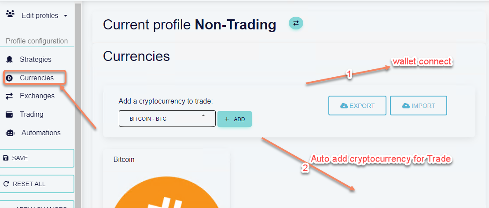

# hctask
HC task

Add wallet connect feature on "currencies" submenu of profile page. After wallet connect, project should display the cryptocurrency list of wallet for Trade. Currently it display Bitcoin only.  

See Github Test Repository. 
https://github.com/Hiring-Support-HashCash-Test/Python-Trading-Website